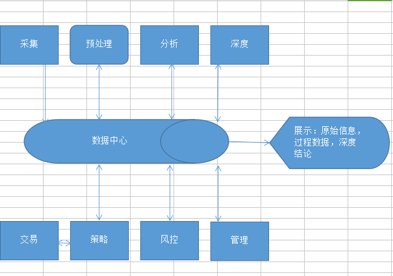
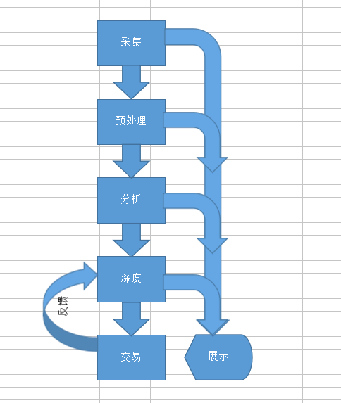

系统架构图：

如前所述，整个系统分两条线走。

一条反应了个人对市场的思考，根据行情的变化，预测新的交易模式，得到一些可执行的策略逻辑，并记录到数据中心。为了方便后续研究，采集、预处理、分析、深度挖掘的信息都会记录到数据中心，并可以根据情况进行展示。

另一条反映了参与市场的过程，也就是俗称的交易了。这里系统首先要解决的就是策略库的扩展性，分两步：1.支持动态链接库形式的扩展；2.支持脚本语言的扩展，比如python和js。然后有风控，有管理。交易策略可以根据深度挖掘的结果进行优化、进化，并且每日复盘之后，对深度分析进行反馈。

数据展示流程图：

参照上面流程图，行情数据和分析结果会以网站的形式进行展示。另外，搭建整个系统过程中一些技术的探讨，会记录在本人博客里。

1. 本公众号记录系统整体架构的思考和进度跟踪

2. 技术细节会记录在博客里面：

   http://blog.wherei.club/

3. 行情和交易的分析结果会展示在网页上，搭建中...