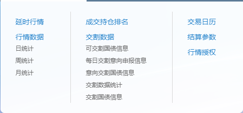

数据采集，范围其实挺广的，分类来说，有这么几个方面：

1.交易所每日公开信息：结算数据，持仓数据，交割数据等等，看个人策略类型需要不同的数据了，比如中金所的每日数据

对于我暂时来说，只需要日统计数据，所以可以考虑写一个采集行情的python工具

2.交易实时行情，就是交易时间段服务器发送过来的tick数据，个人来看，这个最重要。为什么这么说？这就是我们正常交易时间，所接受的驱动数据。所以这个是真的非常重要，如果要分析的话，这是我们最应该花时间研究的了。那么怎么收集呢？找一个专业交易软件商买他的数据，或者自己写一个。专业软件上有文华，彭博之类；自己写怎么写？好问题。。。

3.基本面数据：国家宏观面（利率，M2，进出口，GDP，外汇，国际局势），行业基本面（产业链上下游，扶持政策，收储，产业投资），上市公司财务数据经营数据等等。这个本人用不上，暂时不研究不收集。

4.新闻数据：这个不做时间驱动策略估计也用不上。略过